# Assignment 5 - Point Cloud Data Processing

## Introduction

This assignment processes Point Cloud Data (PCD) for Structural Health Monitoring applications. The solution implements three tasks:

1. **Task 1:** Find the ground level using histogram analysis
2. **Task 2:** Find optimal epsilon for DBSCAN clustering using the k-distance graph method
3. **Task 3:** Identify the largest cluster (catenary) by X-Y area span

**Note:** The ground is filtered out before clustering to ensure the catenary cluster does not include the ground surface.

---

## Task 1: Ground Level Detection

**Method:** Histogram analysis with adaptive binning using the Freedman-Diaconis rule to find the mode of the Z-coordinate distribution.

**Justification:** The ground level is the most common elevation in the point cloud, which corresponds to the mode of the Z-coordinate histogram.

**Results:**
- Dataset 1: Ground level = **61.10 m**
- Dataset 2: Ground level = **61.13 m**

**Plots:**

### Dataset 1 - Ground Level Histogram
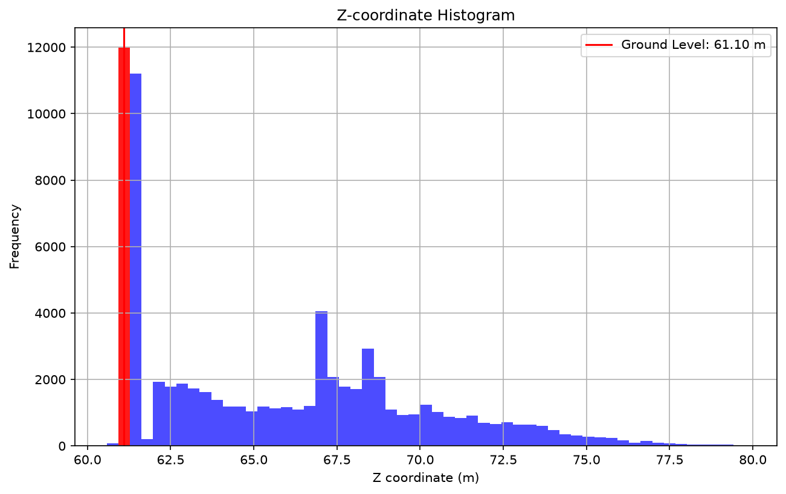

### Dataset 2 - Ground Level Histogram
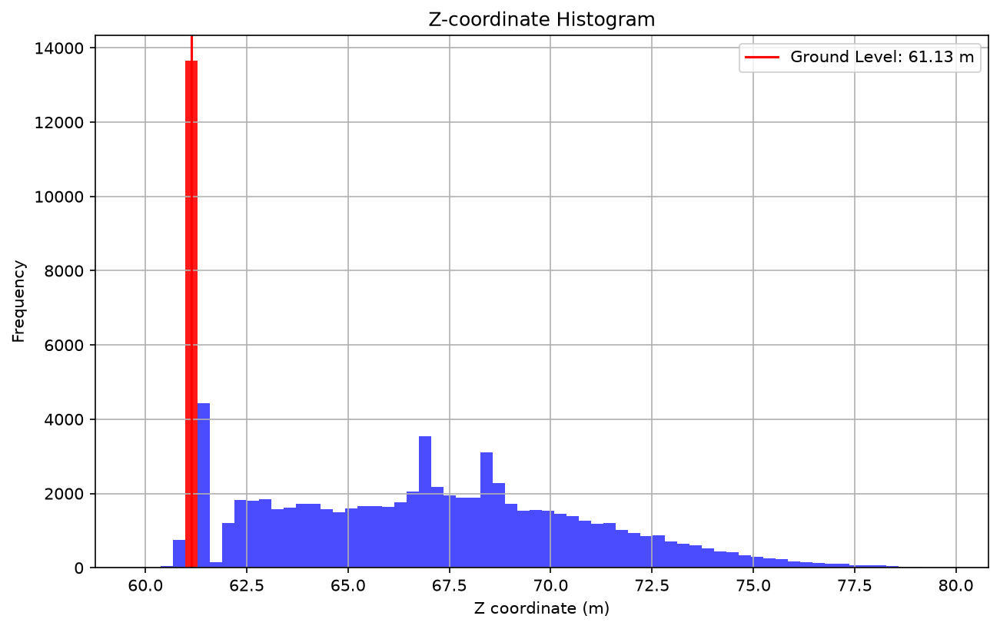

---

## Task 2: Optimal Epsilon for DBSCAN Clustering

**Method:** k-distance graph (k=5) with percentile-based selection (98th percentile) as a proxy for the elbow point. Both k and min_samples are set to 5 for consistency.

**Justification:** The k-distance graph helps identify the optimal epsilon by finding the point where the distance to the k-th nearest neighbor stabilizes, indicating the maximum distance between points within the same cluster.

**Results:**
- Dataset 1: Optimal epsilon = **0.78**
- Dataset 2: Optimal epsilon = **0.50**

**Plots:**

### Dataset 1 - k-Distance Plot (Percentile-based Epsilon Selection)
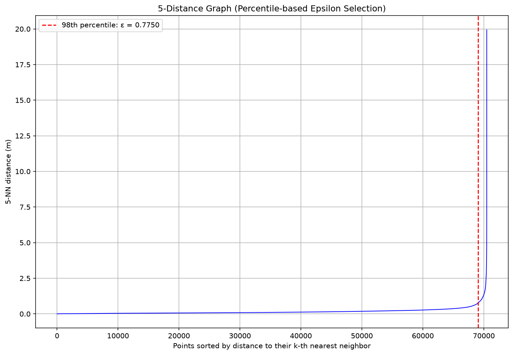

### Dataset 2 - k-Distance Plot (Percentile-based Epsilon Selection)
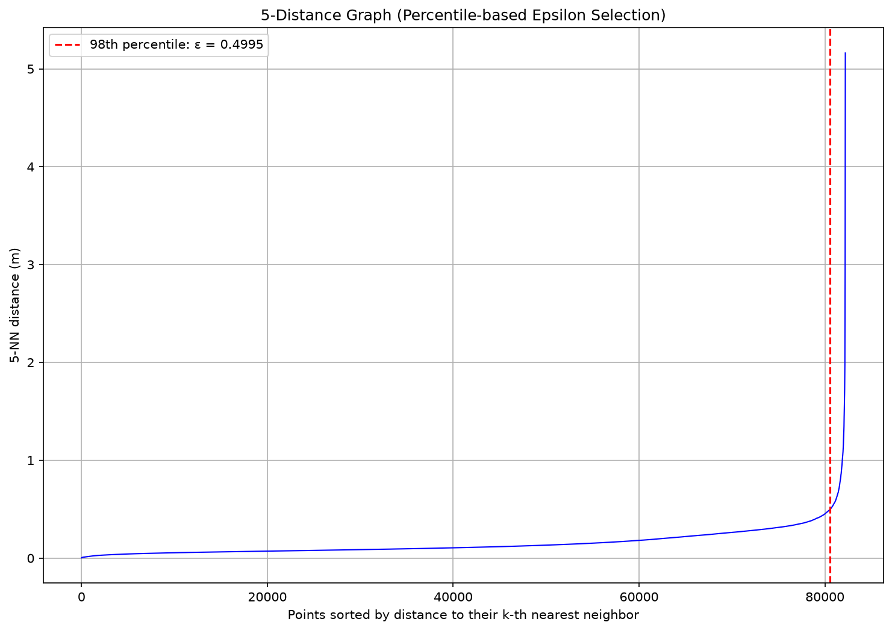

### DBSCAN Clustering (2D)

#### Dataset 1 - DBSCAN Clusters (ε=0.78, min_samples=5)
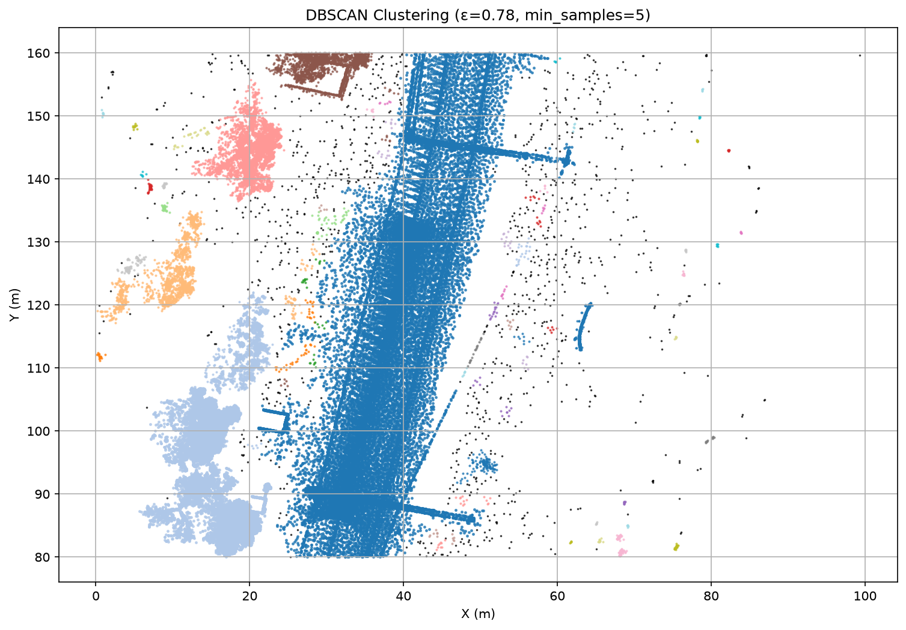

#### Dataset 2 - DBSCAN Clusters (ε=0.50, min_samples=5)
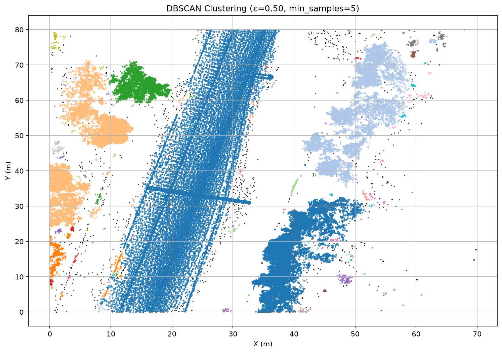

### DBSCAN Clustering (3D)

#### Dataset 1 - 3D DBSCAN Clusters
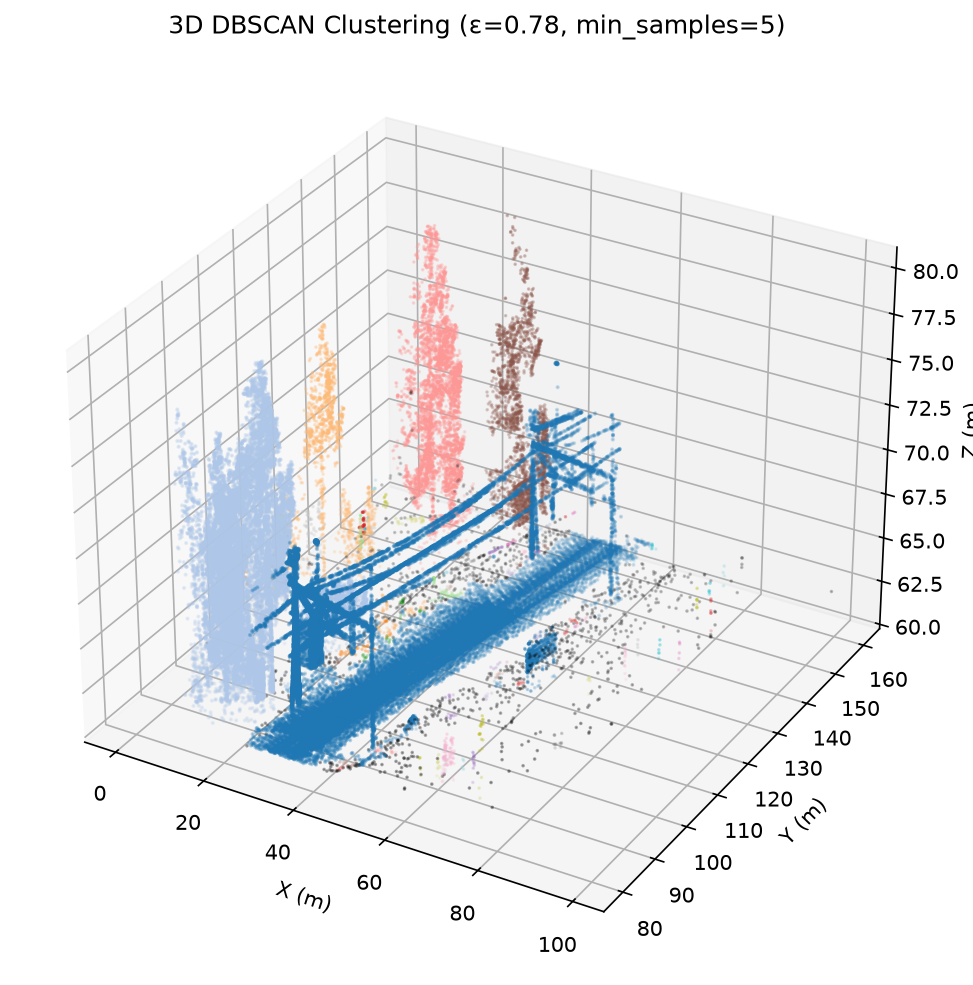

#### Dataset 2 - 3D DBSCAN Clusters
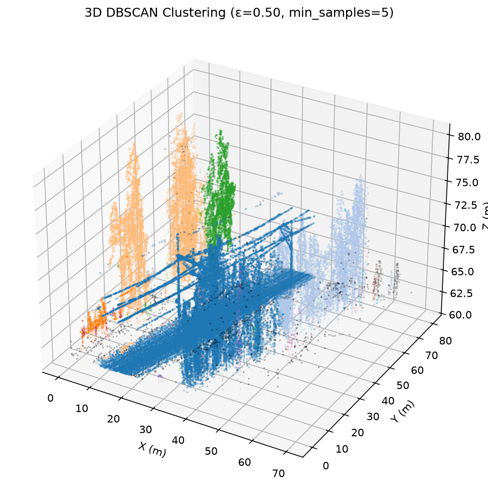

---

## Task 3: Catenary Cluster Identification

**Method:** Identify the largest cluster by X-Y bounding box area (max_x - min_x) * (max_y - min_y). The cluster with the largest area is selected as the catenary.

**Justification:** The catenary is the longest continuous structure in the scene, which should have the largest spatial extent in the X-Y plane.

**Results:**

### Dataset 1
- Catenary cluster: Cluster 0
- Area = **3278.55 m²**
- Point count: 35,351
- Linearity (PCA): 20.64
- Bounds: x=[**21.15 m**, **62.14 m**], y=[**80.01 m**, **160.00 m**]

### Dataset 2
- Catenary cluster: Cluster 0
- Area = **2341.98 m²**
- Point count: 22,073
- Linearity (PCA): 36.25
- Bounds: x=[**8.26 m**, **37.54 m**], y=[**0.00 m**, **80.00 m**]

**Plots:**

### Dataset 1 - Catenary Cluster (2D with bounding box)
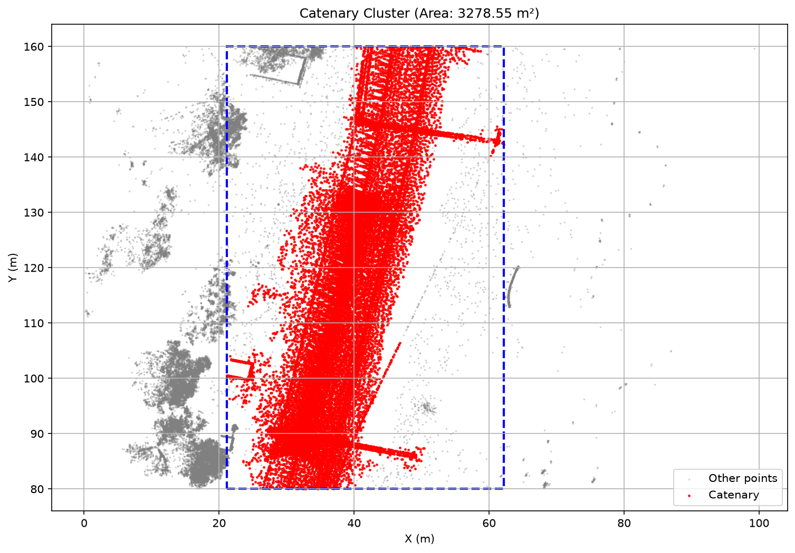

### Dataset 1 - Catenary Cluster (3D)
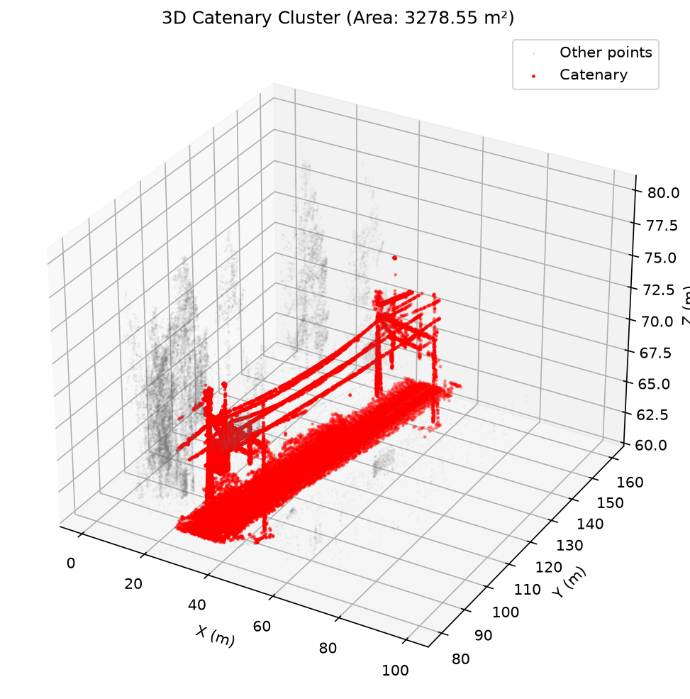

### Dataset 2 - Catenary Cluster (2D with bounding box)
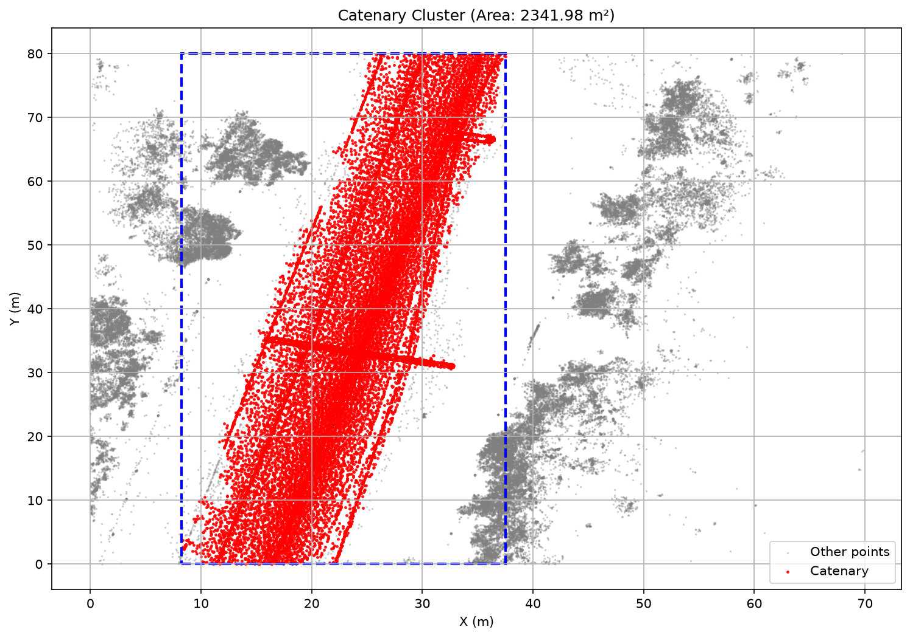

### Dataset 2 - Catenary Cluster (3D)
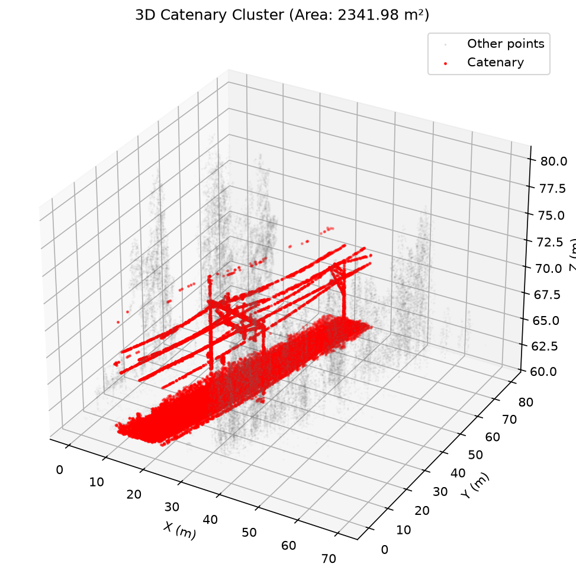

---

## Summary of Results

### Dataset 1
- Ground level = **61.10 m**
- Optimal epsilon = **0.78**
- Area of the catenary cluster = **3278.55 m²**
- Catenary bounds: x=[21.15, 62.14], y=[80.01, 160.00]

### Dataset 2
- Ground level = **61.13 m**
- Optimal epsilon = **0.50**
- Area of the catenary cluster = **2341.98 m²**
- Catenary bounds: x=[8.26, 37.54], y=[0.00, 80.00]

---

## Limitations

1. **Bounding Box Area:** The catenary is selected by largest X-Y bounding box area, which is a proxy. The bounding box of a diagonal object overestimates the true area.

2. **Epsilon Dependency:** The winning cluster depends on the epsilon value. Different epsilon values may result in different clusters being identified as the catenary.

3. **Linearity:** While the largest cluster by area is typically the catenary, the linearity metric (PCA-based) helps verify that the selected cluster is indeed a linear structure (catenary) rather than vegetation or other objects.

---

## Submission

**Highest task attempted: Task 3**

**Dataset 2 results:**
- Ground level = 61.13 m
- Optimal epsilon = 0.50
- Area of the catenary cluster = 2341.98 m²
